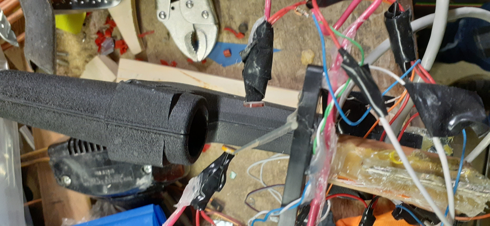

# confocal-lsm
Hardware and software for my homemade laser-scanning confocal microscope

## Origins...
After reading [this Instructables](https://www.instructables.com/id/Laser-Scanning-Microscope/) and [this Hackaday article](https://hackaday.com/2017/02/15/speakers-make-a-laser-scanning-microscope/),
I thought it would be interesting to try my hand at building a laser scanning microscope from CD/DVD drive parts.

# Prototype Iterations:

## V1 (~Summer 2018)
The first iteration scanned the specimen in the x and z axes to change its position relative to a laser beam. The diffused reflection was then measured by a usb camera and recorded into software.

This configuration was not confocal, and could only measure the X-Z plane, but was rather intended as a proof-of-concept test in which I began to learn how to explore this topic deeper.

This first "successful" scan is _most likely_ the product of the laser being brightest with the electromagnetic actuators (taken from the tracking assembly of a CD drive head) most centered (drawing the least current) due to resistance in power distribution:

## V2
The second iteration was the first iteration to be confocal. I used a microscope slide as a beam splitter, with the laser going through a lens moved by the CD drive actuators and a speaker to achieve a third axis of motion. The reflected light was measured by a photoresistor, which proved to have too high of a latency for large scans to be practical.

Ultimately, due to issues of optical beam quality, the laser could not be focused to a small-enough point to be able to draw conclusions from any results of this revision.

I experimented with different lasers in this iteration in an effort to avoid this problem, using a CD laser and a laser diode from a common laser pointer.

In doing this, I also experimented with a number of simple laser driver circuits (current-limited supplies)

## V3 (2020)
The third iteration rehashed the idea of using a speaker as an actuator, but used a USB camera again as a sensor. I repurposed a desktop PC case and power supply for this iteration to provide a rigid mounting system and reduce current limitation issues.

_Testing for independence of laser intensity and actuator current draw (good power distribution)_

_Closeup of the scanning mechamism_

This iteration also involved completely rewriting the software- I created a graphical user interface with PyQT4 and rewrote the image processing to obtain more accurate intensity measurements from the USB camera:

_A screenshot of the GUI_

I did manage to get a few reasonable images from this iteration of the microscope, the best one being the following:

_A scan of the mesh from a speaker grille from a handheld radio_

## V4 (2021-)
### Using a Photodiode...
For this iteration, I decided to further investigate how to measure the intensity of transmitted and/or reflected light.
I observed the die of a photodiode used in the optical head of the CD drive under a microscope:

It happens that CD drives use a compound photodiode to assist in focusing. After a number of attempts to interface to this photodiode as it was wired into the electronics of the CD drive, I settled upon using a different photodiode instead.

### CAD & Redesigned Scanning Mechanism

I then designed a modular frame in FreeCAD, before transfering my design to Fusion360:

_A Fusion360 Render of the microscope frame_

_A close-up of the scanning stage and optical head_

### Electronics

There were also a number of electronic improvements in this iteration- PWM control of the actuators was replaced by 2N2222-based drivers controled by DACs. An LM317 was used to create a constant-current source for the laser diode. Also, the microscope communicates with a computer via the WiFi connection of an ESP8266, with an Arduino Nano being used to handle some of the interfacing tasks over I2C. Overall, this revision represents major improvements in reliability, resolution, and quality.

_The electronics on a breadboard_

### Software

The software was rewritten in Java, with a number of improvements, such as...
- Interpreted script-based description of a scanning pattern
- More flexible data aggregation
- More data processing to produce 3-D contour plots of a surface
- Threads to process and recieve data efficiently

## Conclusion / Continued Work

I have yet to obtain a scan from this iteration which truly represents the specimen being scanned, but further work will involve reliability improvements and reducing stiction in the stage to improve precision of the actuators in order to push closer to this goal.
